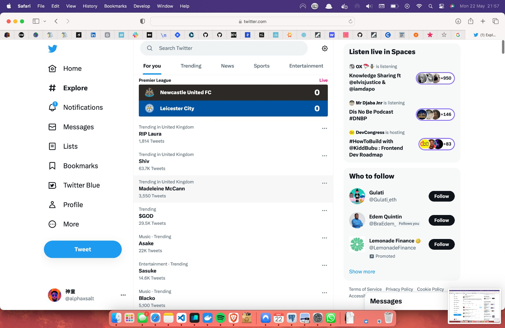
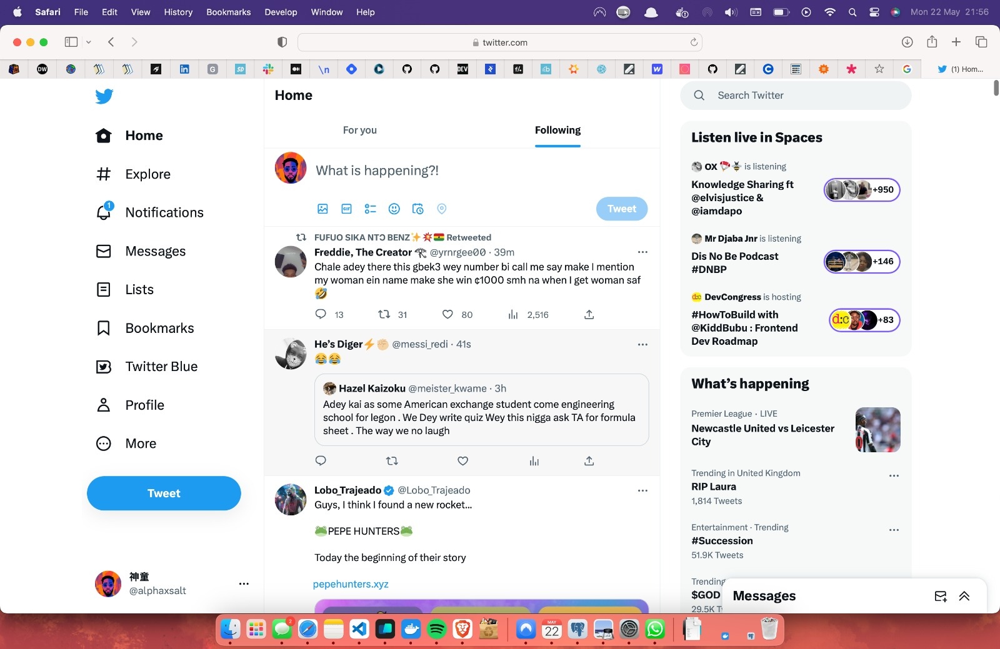
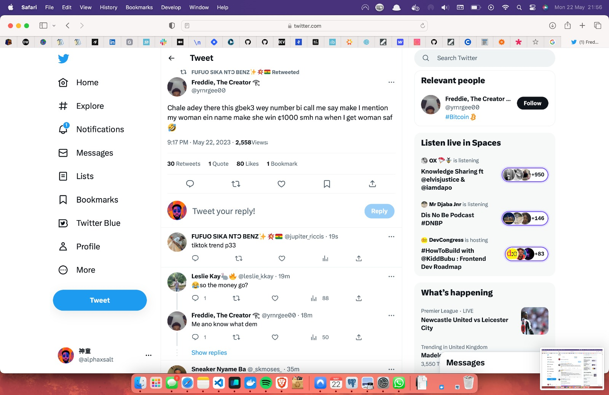

# Twitter Clone

## Getting Started

First, run the development server:

```bash
npm run dev
```

This will start the tweets server and the nextjs app

The tweets server is running on [http://localhost:3333](http://localhost:3333)

Available routes:

- http://localhost:3333/tweets
- http://localhost:3333/users
- http://localhost:3333/likes

Open [http://localhost:3000](http://localhost:3000) with your browser to see the result.




